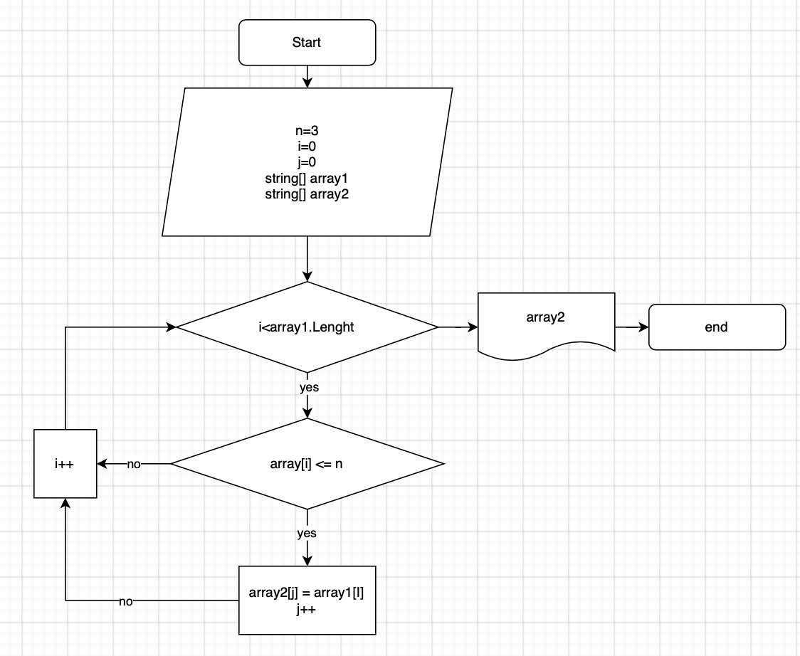

# Итоговая проверочная работа 

**Задача:**
Написать программу, которая из имеющегося массива строк формирует массив из строк, длина которых
меньше либо равна 3 символа. Первоначальный массив можно ввести с клавиатуры, либо задать на старте
выполнения алгоритма. При решении не рекомендуется пользоваться коллекциями, лучше обойтись
исключительно массивами.

*Примеры:*

[“hello”, “2”, “world”, “:-)”] -> [ “2”, “:-)” ]

["1234", "1567", "-2", "computer science"] -> [ "-2" ]

["Russia", "Denmark", "Kazan"] -> [ ]

## Решение задачи:
1. Создае массив из строк, задаем его длину и заполняем примером из задачи
2. Создаем новый массив, равный длине изначального
3. Создаем метод (_ArrayTransfer_), проверяем длину каждого элемента из первоначального массива. Если длина элемента, меньше либо равна трем символам, наш метод переносит этот элемент в новый массив. 
4. Создаем метод (_PrintArray_), выводим новый массив на экран
5. Вызываем метод _ArrayTransfer_
6. Вызываем метод _PrintArray_

# Дополнительная информация
Добавили диаграмму решения задачи
